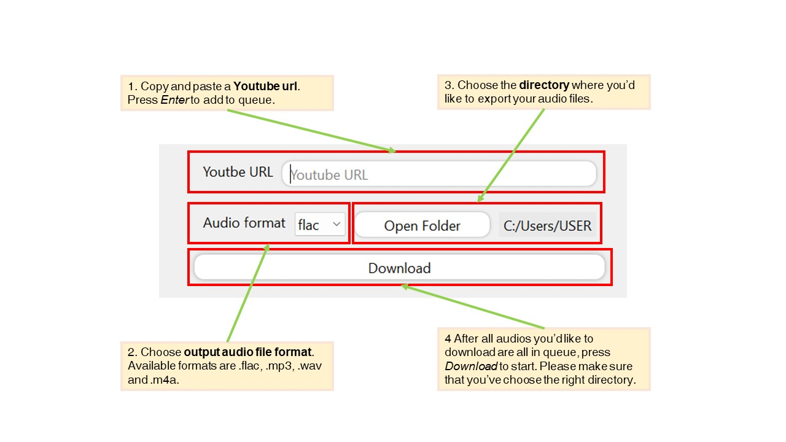
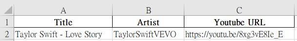
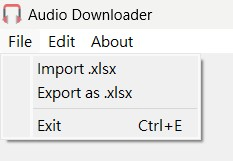

# Audio-Downloader

## Modules
```python
# Python 3.11.1
# pip 22.3.1
pip install PyQt5 pytube pydub requests pandas openpyxl mutagen
```

## Release

> [Audio Downloader_v2.0.1](https://github.com/Xuan-Yi/Audio-Downloader/releases/tag/v2.0.1)

- This release works at my Win11, but not sure for other systems.
- Please **DO NOT** move _Audio Downloader_vx.x.x.exe_ out of the folder _Audio Downloader_vx.x.x_. You can place the folder anywhere.
- Instead, create a **shortcut(捷徑)**, then you can access _Audio Downloader_vx.x.x.exe_ everywhere.

> This tool is **NOT FOR COMMERCIAL USAGE**, please be careful when using this kind of programs.

- This tiny program use [pytube](https://github.com/jiaaro/pydub.git) to download audio. Then convert the audio with [pydub](https://github.com/kkroening/ffmpeg-python.git) and add tags with [mutagen](https://pypi.org/project/mutagen/).
- The GUI is powered by [PyQt5](https://pypi.org/project/PyQt5/)
- **pydub requires ffmpeg, install it by yourself.** (also included in the release)
- Available auio formats are
  - flac
  - mp3
  - wav
  - m4a

## Introduction

### Basics

* Add a song to queue with following steps.
* Please make sure that the directory is right.


* It will generate an unit and push into the queue. 


### Import the pre-saved queue file (xlsx or csv file)

* An example of format is shown below. Meaning of colums from left ot right are **title, artist, url** respectively.
* First row needn't be the same, since this program will just skip it.



* Import pre-saved queue file bt **File > Import .xlsx**. Again, csv file is also available. 
 



## Copyright Claim

- [icon.ico](https://github.com/Xuan-Yi/Audio-Downloader/blob/main/readme_imgs/window.jpg)： <a href="https://www.flaticon.com/free-icons/headset" title="headset icons">Headset icons created by smalllikeart - Flaticon</a>